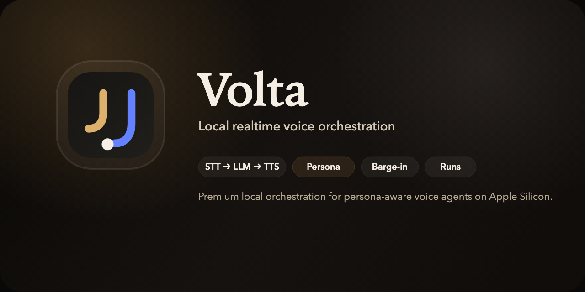

<p align="center">
  
</p>

<p align="center">
  
</p>

# Volta

Volta is a local realtime voice app for low-latency `STT -> LLM -> TTS` conversations, with persona control, saved runs, and a browser harness for building and evaluating voice agents on Apple Silicon.

Volta is intentionally end-to-end:

- `Console` for live conversation
- `Persona` for session prompt control
- `Runs` for saved transcripts, outputs, and audio artifacts

There are no standalone STT-only, LLM-only, or TTS-only product screens.

## Repo Layout

```text
volta/
├── apps/
│   ├── api/        # FastAPI backend and tests
│   └── web/        # Vite + React frontend
├── prompts/        # Bundled persona prompts
├── samples/        # Public synthetic samples
├── scripts/        # Setup, doctor, and local dev helpers
├── MODEL_SETUP.md  # Provider and local model setup
├── .env.example    # Provider and runtime configuration
└── Justfile        # Common developer commands
```

## Prerequisites

- Python `3.14+`
- [uv](https://docs.astral.sh/uv/)
- Node.js `18+`
- npm
- `just` is recommended, but not strictly required

## Quickstart

Clone the repo and create your local env file:

```bash
git clone https://github.com/nihal1294/volta.git
cd volta
cp .env.example .env
```

For the default `openai` provider, set at least:

```dotenv
PROVIDER=openai
OPENAI_API_KEY=your-key-here
```

Then start the stack:

```bash
just quickstart
```

This command:

1. installs backend and frontend dependencies
2. runs `just doctor`
3. starts the backend and frontend together
4. cleans both child processes up when you stop it

## Doctor

Use `just doctor` before debugging runtime issues.

It checks:

- Python, `uv`, Node, and npm availability
- backend/frontend project files
- frontend dependency install status
- default prompt presence
- public sample presence
- provider-specific env requirements

Examples:

```bash
just doctor
just setup
```

## Common Commands

```bash
just setup
just doctor
just api
just web
just dev
just test
just lint
just fmt
just clean
```

## Providers

Volta supports two backend providers selected from the repo-root `.env`:

- `openai` - default
- `local` - Apple Silicon local runtimes

The backend reads plain env keys such as:

- `PROVIDER`
- `OPENAI_API_KEY`
- `OPENAI_LLM_MODEL`
- `OPENAI_TRANSCRIPTION_MODEL`
- `OPENAI_TTS_MODEL`
- `OPENAI_TTS_VOICE`
- `STT_PYTHON`
- `LLM_PYTHON`
- `TTS_PYTHON`
- `LLM_MODEL_PATH`

See [MODEL_SETUP.md](MODEL_SETUP.md) for provider-specific setup.

## Frontend

The frontend lives in `apps/web/` and talks to:

- `GET /v1/health`
- `GET /v1/voices`
- `GET /v1/persona`
- `GET /v1/runs`
- `GET /v1/runs/{session_id}`
- `WS /v1/realtime`
- `GET /v1/artifacts/...`

The websocket defaults to:

- `ws://127.0.0.1:8765/v1/realtime`

Override it if needed:

```bash
cd apps/web
VITE_VOLTA_WS_URL=ws://127.0.0.1:8765/v1/realtime npm run dev -- --host 127.0.0.1 --port 4173 --strictPort
```

## Saved Runs

Saved sessions are written to:

- `.runtime/runs/<session_id>/`

Typical artifacts include:

- input audio
- committed transcript
- LLM output
- TTS output
- timeline events

`.runtime/` is local-only and gitignored.

## OpenAI Codex Hackathon Bengaluru

Volta was thought through as part of the [OpenAI Codex Hackathon Bengaluru](https://luma.com/x495vdw1?tk=xEpFzO).

The project focus was not just “speech in, speech out.” The product shape was designed around:

- explicit floor-taking instead of automatic reply spam
- persona-controlled voice behavior
- file and live testing in the same harness
- replayable saved runs for debugging and evaluation
- a backend that can swap between OpenAI and local Apple Silicon model paths

## Application Areas

The strongest near-term application areas for Volta’s current end-to-end voice workflow are:

- meeting facilitation and searchable conversation summaries
- sales and support call coaching
- gaming and voice-first NPC interactions
- media and podcast transcription workflows
- education and lecture capture
- accessibility-oriented captioning and voice assistance

These are practical domains where the same low-latency speech pipeline can be adapted without changing the end-to-end product shape.

## Troubleshooting

### `just doctor` fails

Read the failure output literally. It is designed to tell you which missing env var, runtime path, or dependency to fix.

### Frontend changes do not appear

Volta runs Vite with `strictPort` and cache-busting headers. If `4173` is busy, the frontend should fail loudly instead of silently hopping to another port.

### Local provider does not start

The local provider requires valid runtime executables and a real Gemma model path. See [MODEL_SETUP.md](MODEL_SETUP.md).

### OpenAI provider starts but transcripts are weak

That usually points at model/provider quality rather than frontend breakage. Start with the bundled synthetic sample before comparing live or human audio.
